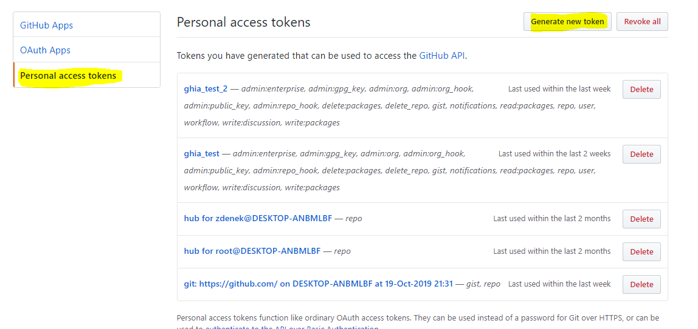

GHIA README
===========

Pusrpose of GHIA application is to assign issues to users, based on the
content of the issue. Example: When the test of the issues contains string
"network error", the it is assigned to user PepaNovak.

rules.cfg
_________

.. code-block:: cfg

    [patterns]
    MarekSuchanek=
    title:network
    text:protocol
    text:http[s]{0,1}://localhost:[0-9]{2,5}
    label:^(network|networking)$
    hroncok=any:Python

    [fallback]
    label=Need assignment

.. line-block::

    The rules always starts with one of the following strings **title:** ,
    **text:**, **label:**, **any:** descripting where to find the pattern.
    Following after coma is the regex pattern. There can be more rules for
    single user, every rule is separated by new line.
    Section labeled **fallback** is optional and is used only when any of the
    rules cnaot be successfully applied to issue.

auth.cfg
________

.. code-block:: cfg

    [github]
    token=TOKEN
    secret=WEBHOOK_SECRET

.. line-block::

    File **auth.cfg** is used to store auth details for repo. You must
    generate token for this app on the github ui.

Running the app
_______________

.. line-block::

    The app can be launched by file **ghia.py**

.. sourcecode:: c

    Usage: ghia.py [OPTIONS] REPOSLUG

    CLI tool for automatic issue assigning of GitHub issues

    Options:
    -s, --strategy [append|set|change]
                                  How to handle assignment collisions.
                                  [default: append]
    -d, --dry-run                   Run without making any changes.
    -a, --config-auth FILENAME      File with authorization configuration.
                                  [required]
    -r, --config-rules FILENAME     File with assignment rules configuration.
                                  [required]
    --help                          Show this message and exit.

.. line-block::

    The reposlug is part of url 'user/repo_name'. The app will affect all
    isues in given repository.

Switches
________

.. code-block:: c

    --strategy [append|set|change]

.. line-block::

    Application uses different strategies for adding users.
    **Append** means that asignee is apended to the existing set of assignees
    **set** assign the issue to the user only if there is no assignee jet
    **cahnge** is pretey selfexplanatory. Assigne is cahnged in case the the
    rule can be applied

.. code-block:: c

   --dry-run

.. line-block::

    When this flag is set then the app does not aplly any changes to actual
    repo only listts them to output

.. figure:: screen_changes.png
   :scale: 50 %
   :align: center

.. figure:: screen_fallback_label.png
   :scale: 50 %
   :align: center

doctest
_______

.. line-block::

    Matcher methods in common module can be tested wit doctest

.. code-block:: python

    ./ghia>python -m doctest common.py

.. code-block:: python

    def _match_any(*args):
    """
            :param pattern:
            :param issue:
            :return: [True] if issue contains the pattern

            >>> _match_any('aaa',{'labels': [{'name': 'aaa'}],'body': 'bbb','title': 'bbb'})
            True

            >>> _match_any('aa',{'labels': [{'name': 'bbb'}],'body': 'bbb','title': 'bbb'})
            False

            >>> _match_any('aa',{'labels': [{'name': 'bbb'}],'body': 'aa','title': 'bbb'})
            <re.Match object; span=(0, 2), match='aa'>

            >>> _match_any('aa',{'labels': [{'name': 'bbb'}],'body': 'bb','title': 'aa'})
            <re.Match object; span=(0, 2), match='aa'>
        """
    return _match_title(*args) or _match_text(*args) or _match_label(*args)

